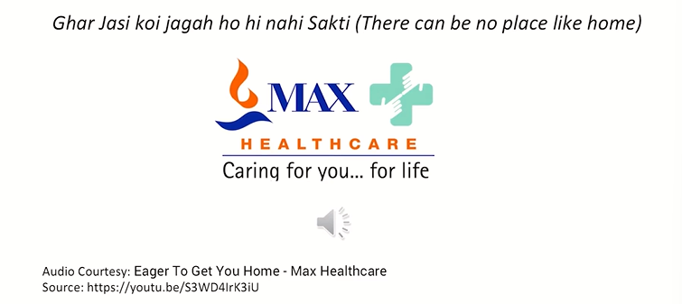
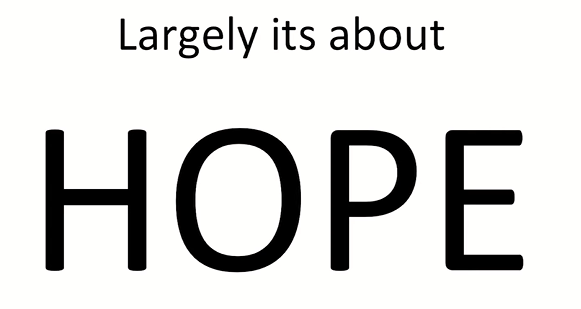
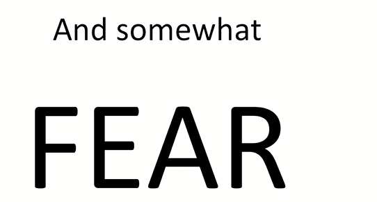

# Learning outcomes

Week 1  
* What is IMC
* Role of IMC in Marketing
* Emerging trends in Integrated Marketing communication

Week 2  
* Design Thinking has something to do with IMC
* Enhancing the effectivity of Communication

What comes to the mind when we wish to hear something...?
OR  
What hits our mind when we wants to hear something?  

We want to hear something that  
We are searching for... desire for...

* Marketing communications is all about bringing things closer to the customer.
* Certain words connotate happiness.
    > Even if they do not actually make us happy, they connote happiness. They initiate that thing basically
* Most of those words are found in advertisements.
* Look Around-Those words are all around you ...
    > Randomly pull up any advertisement


```txt
And here I welcome you to the mesmerizing
world of integrated marketing communication.
It definitely should mesmerize you because
once you enter into this world and start
looking towards the Messages all around us, the advertisements all
around us, the way organizations and
products and services want to reach to you
once, once you, you know, step into it, you will
really feel that there is so much of creativity,
there is so much of thoughtfulness.
In fact, you know, we can say that its
magic. It propels us. It motivates us. We start desiring for things.
We start aspiring for things and actually convert that throught into a purchase
```


```txt
two drops they just fall into the mouth of a child? Mother
feels safe that now child would be away from
polio and that is, that is the kind of impact this
communication brings in. This is all about magic it carries
```


## Magical words in Marketing Communications

* Dil and More .... Yeh Dil Maange More! (This Heart Desires More)
* Aao Chalein (Lets Go)
* Aasmaan (Sky)
* Aapki Apni ..... Aap Ki Apni Dukan (Amazon)
* Dosti (Friend)
    * > Which talks about compassion, closeness, dependence, so many things.
    * > So if a product is telling you that we are your friends then it is actually bringing you closer to themselves
* Har Kaam Desh Ke Naam .... Indian Navy
* Raksha (Safety)
* Assurance

```txt
And this actually, you know, enhances your
spirit that whatever am I doing and if I am of
that age and that caliber, I should be thinking
to, you know, join the defense forces. And
then suddenly those distinguished gentlemen,
they come to your mind, you know, walking in
their uniforms.
And then suddenly your mind goes towards
that kind of thing. People like me start
thinking why I didn't do that. I don't know. I
don't know. But but again, I still aspire for if
time could be reversed and I could have
joined the forces, so.
```



```txt
Probably that is going
to make you realize that how music plays an
equal part as far as the words go.
This is a beautiful advertisement, one of my
favorites. And once you visit this website and
see this advertisement, you would realize that
the kind of comfort it generates in the minds
of patients and their families as well the kind
of assurance it generates this this very specific
tune.
Imbibed in that storyboard and where the this
this?
Tagline comes in the end wherein they they
generously, beautifully say ghar jasi koi jaga
hohi sakti. It's that there's nothing like home
jaldi gharnate go back home early. A
healthcare organization talking about going
back home early as possible is such a big
assurance to a patient actually, because
everyone you see, no one in this world who
goes to hospital doesn't wants to go back
home.
```





```txt
Ladies and gentlemen, largely this.
Magic takes you towards hope, and this is one of the most.
Important work.
Words associated with integrated marketing communication hope.
Why it is so important? We will realize this in due course of time,
but by the end of this course you would realize that almost whole
of the world of integrated marketing communication is associated
with this word hope, largely. Largely. I am not saying other other
keywords are not there, but largely it is associated with hope
basically.
And I'll talk about this more, but then somewhat there is fear as
e.ah
well. And that fear tells us that this may happen if this.
Is not taken care
```
* दो गज़ दूरी मास्क है जरूरी ।
* उम्मीद पे दुनिया क़ायम है । Hope is actually propelling this world .