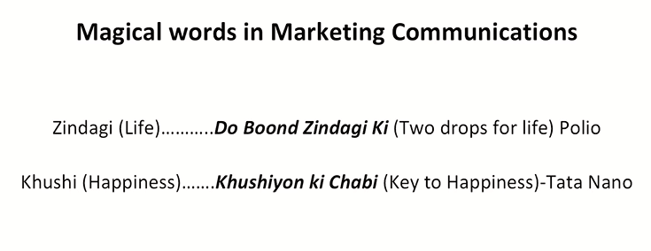
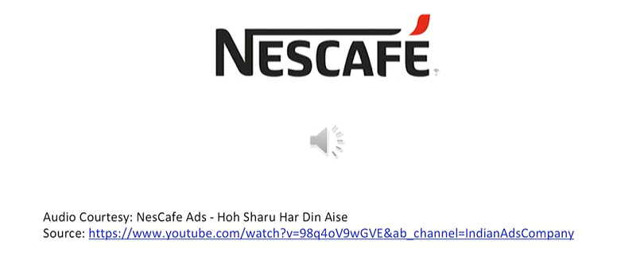

# Learning outcomes

Week 1  
* What is IMC
* Role of IMC in Marketing
* Emerging trends in Integrated Marketing communication

Week 2  
* Design Thinking has something to do with IMC
* Enhancing the effectivity of Communication

What comes to the mind when we wish to hear something...?
OR  
What hits our mind when we wants to hear something?  

We want to hear something that  
We are searching for... desire for...

* Marketing communications is all about bringing things closer to the customer.
* Certain words connotate happiness.
    > Even if they do not actually make us happy, they connote happiness. They initiate that thing basically
* Most of those words are found in advertisements.
* Look Around-Those words are all around you ...
    > Randomly pull up any advertisement


```txt
And here I welcome you to the mesmerizing
world of integrated marketing communication.
It definitely should mesmerize you because
once you enter into this world and start
looking towards the Messages all around us, the advertisements all
around us, the way organizations and
products and services want to reach to you
once, once you, you know, step into it, you will
really feel that there is so much of creativity,
there is so much of thoughtfulness.
In fact, you know, we can say that its
magic. It propels us. It motivates us. We start desiring for things.
We start aspiring for things and actually convert that throught into a purchase
```



```txt
two drops they just fall into the mouth of a child? Mother
feels safe that now child would be away from
polio and that is, that is the kind of impact this
communication brings in. This is all about magic it carries
```

