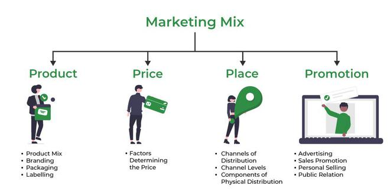

# Lecture 04 : Effective Marketing Communication

e.g. Hero cycles  
Patanjali products - Positioning is they are selling pure products  

```txt
communication actually not only creates the
OR establishes the positioning, but the
relevance of the associated price of the
product, the expectations from the product, all
the aspects and elements related to that
product starting from the design and the
packaging and so on.
```



Amazon ad - आपकी अपनी दुकान  

