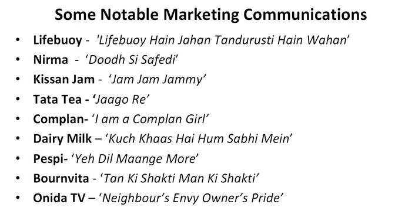

# Lecture 04 : Effective Marketing Communication


```txt
So communication is all about now
that communication.
Which is structurally delivered by the
marketer.
Definitely prompts the customer to think
about the price and the perspective associated
with his expectations, which he wished to carry
for that particular kind of a product.
```

```txt
Last time we Mentioned about Lenskart and Nike, let's start talking of an
automotive, for example a two wheeler.
What kind of aspirations people do have in their minds when they
go to purchase?
A two wheeler like Honda Activa.
Or Honda scooter for that matter.
What comes to their mind? Why are they attracted towards this
product?
Just because of that it is a good product or there is?
Some element of positioning associated with this product. In their
mind it is convenient.
It has good after sales service.
It is working fine for others.
It has low service cost.
It has low maintenance or whatever, whatever is you know, being
positioned by the organization.
You start wondering on this element and you would realize that it
has become a largely sold automotive in this country.
```

e.g. Hero cycles  
Patanjali products - Positioning is they are selling pure products  

```txt
communication actually not only creates the
OR establishes the positioning, but the
relevance of the associated price of the
product, the expectations from the product, all
the aspects and elements related to that
product starting from the design and the
packaging and so on.
```


Amazon ad - आपकी अपनी दुकान  

> They came and conqured.  
> Should I say thank you to these online opitons  
> Because we could get what we wanted in due course of time  
> And somehow we must not have known that we will find everything online if   
> somehow they would not have communicated that so emphasizingly in due course of time  
> They have been saying for number of years that they have N number of things available
> for N number of people for all sorts of people  
> And then habitually, by instigation or by references, we started surfing for those  
> things. And we started finding the relevant prices, the relevant combinations, the relevant choices and so on  
> And that is where consistency and relevance start  

